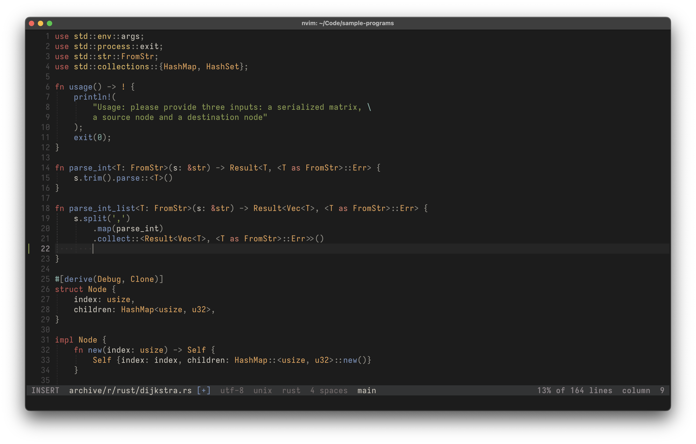

<h3 align="center">carbide.nvim 🪨</h3>

<p align="center">A configurable Neovim colorscheme with support for Tree-sitter highlighting and many plugins.</p>

<div align = center>

[Installation](#installation)&ensp;∙&ensp;[Applying](#applying)&ensp;∙&ensp;[Configuration](#configuration)&ensp;∙&ensp;[Extras](#extras)&ensp;∙&ensp;[Contributing](#contributing)
</div>

---

<table width="100%">
    <tr>
        <th>Light</th>
        <th>Dark</th>
    </tr>
    <tr>
        <td width="50%">
            
        </td>
        <td width="50%">
            
        </td>
    </tr>
    <tr>
        <td colspan="2"><p align="center"><i>(click on the images to enlarge them)</i></p></td>
    </tr>
</table>

> [!NOTE]
> carbide.nvim is a work in progress. While the configuration format is stable there may be slight changes to the colors, their names and their use throughout the colorscheme.

> [!IMPORTANT]
> Something does not look good in your favorite language or support for a plugin or terminal is missing? Feel free to [open an issue or submit a PR](#contributing) to fix it!

---

## <a name="installation"></a>Installation 📦

You can install carbide.nvim manually or using your plugin manager of choice. All that matters is that it gets placed in a directory where Neovim can find it (see `:help runtimepath` inside Neovim for such locations). Two examples are given below.

### Requirements
- Neovim 0.10 or above
- A terminal with [true color](https://en.wikipedia.org/wiki/Color_depth#True_color_(24-bit)) support

### Examples

**Manual installation with Git:**

```sh
mkdir -p "${XDG_DATA_HOME:-$HOME/.local/share}/nvim/site/pack/carbide/start" && \
git clone https://github.com/ferdinandrau/carbide.nvim \
"${XDG_DATA_HOME:-$HOME/.local/share}/nvim/site/pack/carbide/start/carbide.nvim"
```

**Installation (and use) with [lazy.nvim](https://github.com/folke/lazy.nvim):**

```lua
{
    'ferdinandrau/carbide.nvim',
    priority = 1000,
    opts = { --[[ your options here ]] },
    config = function(_, opts)
        require('carbide').setup(opts)
        require('carbide').apply()
    end
}
```

## <a name="applying"></a>Applying 🎨

carbide.nvim registers three colorschemes for you to choose from. They can be appiled via the `apply` function or the Vim command `:colorscheme`, both ways are equivalent.

- `carbide` respects Neovim's `background` option, changing between light and dark to match it.

  ```lua
  require('carbide').apply()
  -- or
  -- vim.cmd.colorscheme('carbide')
  ```

- `carbide-light` always shows the light variant, irrespective of `background`.

  ```lua
  require('carbide').apply('light')
  -- or
  -- vim.cmd.colorscheme('carbide-light')
  ```

- `carbide-dark` always shows the dark variant, irrespective of `background`.

  ```lua
  require('carbide').apply('dark')
  -- or
  -- vim.cmd.colorscheme('carbide-dark')
  ```

## <a name="configuration"></a>Configuration ⚙️

The `carbide` Lua module also provides a `setup` function to customize the appearance of the colorscheme. It does not have to be called if you are happy with the defaults. Make sure to call it before applying the scheme, otherwise there is no way for your options to take effect.

A call to `setup` looks something like this:
```lua
require('carbide').setup({
    style = {
        keywords = { bold = true },
        strings = { italic = true },
    },
    palette_overrides = {
        dark = {
            bg1 = '#17131C',
            bg2 = '#222028',
            fgc_green = '#0F5722',
            fgc_blue = '#0B4AED',
        },
    },
})
```

The upcoming three subsections include everything there is to say about `setup`, complete with examples that should hopefully clear up any confusion. If questions persist you can always ask, just make sure to do it [in the right place](#contributing)!
<!-- </details> -->

<!-- <details><summary><b>Default Options</b> <i>(click to expand)</i></summary> -->

### Default Options


```lua
{
    set_terminal_colors = true,
    fallback_background = "light",
    style = {
        transparent = false,
        gutter = "editor",
        keywords = { bold = false, italic = false },
        variables = { bold = false, italic = false },
        functions = { bold = false, italic = false },
        strings = { bold = false, italic = false },
        comments = { bold = false, italic = false },
    },
    plugins = {
        ["lazy.nvim"] = true,
        ["mason.nvim"] = true,
        ["indent-blankline.nvim"] = true,
        ["gitsigns.nvim"] = true,
        ["telescope.nvim"] = true,
        ["nvim-tree.lua"] = true,
        ["neo-tree.nvim"] = true,
        ["mini.icons"] = true,
        ["nvim-cmp"] = true,
        ["blink.cmp"] = true,
    },
    palette_overrides = false,
    scheme_overrides = false,
}
```

### Option Reference

<details><summary><i>(click to expand)</i></summary>

\
**`set_terminal_colors`**
 - **Expects:** `boolean` 
 - **Description:** Whether to change the 16 colors of the built-in terminal.

**`fallback_background`**
- **Expects:** `"light"` or `"dark"`
- **Description:** The variant to use when the dynamic version (the `carbide` colorscheme) is applied and the `background` option is – for some weird reason – empty.

**`style.transparent`**
- **Expects:** `boolean`
- **Description:** Whether to show a solid background or not: If set to true, the underlying GUI's background will show through, which is usually needed for a transparency effect.
    </tr>

**`style.statuscolumn`**
- **Expects:** `'editor'` or `'editor_extended'` or `'solid'` or `'solid_extended'`
- **Description:** Determines how the statuscolumn (the area containing line numbers, signs etc.) is highlighted. The values with the "editor" prefix will give it the same background color as the editing area, the "solid"-pefixed values will make it have a distinct color. The "extended" version of each will make the cursorline extend into the statuscolumn. Here are some screenshots illustrating the difference:

    <table width="100%">
        <tr>
            <td><p align="center"><tt>"editor"</tt></p></td>
            <td><p align="center"><tt>"editor_extended"</tt></p></td>
            <td><p align="center"><tt>"solid"</tt></p></td>
            <td><p align="center"><tt>"solid_extended"</tt></p></td>
        </tr>
        <tr>
            <td width="25%">
                
            </td>
            <td width="25%">
                
            </td>
            <td width="25%">
                
            </td>
            <td width="25%">
                
            </td>
        </tr>
    </table>

  Please note that the extended cursorline highlighting feature `culhl` for signs is both poorly designed and not supported by many plugins. The background color of the cursorline may clash with that of signs because of this.

**`style.keywords`** \
**`style.variables`** \
**`style.functions`** \
**`style.strings`** \
**`style.comments`**
- **Expects:** `table` with up to two keys `bold` and `italic` that have `boolean` values
- **Description:** Shorthands for common customizations of syntactic elements.

**`plugins.*`** (meaning **`plugins['telescope.nvim']`**, **`plugins['nvim-tree.lua']`** etc.)
- **Expects:** `boolean`
- **Description:** Whether to create highlight groups for the particular third-party plugin. The performance gain from setting this to `false` is minimal, but it's nice to have the option to nonetheless.

**`palette_overrides`**
- **Expects:** `false` or table with up to two keys `light` and `dark` that have `table` values themselves, mapping arbitrary color names to actual colors
- **Description:** Allows you to override existing colors and define new ones. A table will be merged with the `DEFAULT_PALETTE` defined inside `lua/carbide/palette.lua`. To get a feel for the expected table structure, take a look at it and the examples below. `false` is functionally equivalent to an empty table.

**`scheme_overrides`**
- **Expects:** `false` or `function` that takes up to three parameters (signature `fun(colors?, variant?, style?)`)
- **Description:** Allows for complete highlight customization. To use this, set it to a custom function that will receive the appropriate colors (the `light` or `dark` part of the palette), which variant (the string `'light'` or `'dark'`) a scheme is to be created for and the `style` table from the configuration . The function should return a table containing key-value pairs that specify highlights: The keys should be highlight group names, the values tables of options to be passed to `nvim_set_hl`. See `fill_default_scheme` inside `lua/carbide/schemes.lua` for the default mapping and the examples to get a feel for it. `false` is functionally equivalent to a function which returns an empty table. \
The things you specify here take precedence over everything else, including the `style` configuration option, which exists purely for the convenience of not having to use this option if all you want are the little tweaks for keywords, strings etc. it provides. The current state of `style` is passed to your function to give you the option to respect it, but you don't have to. The third example shows how to implement `scheme_overrides` while still follwing `style`. `variant` can be used to conditionally return different things, for example to make variable names blue in dark mode but black in light mode.

If you're familiar with Lua type annotations you may also be interested in [the exact types](lua/carbide/types.lua) of these options.

</details>

### Examples

<details><summary><b>Making keywords bold and comments italicized via <tt>style</tt></b></summary>

```lua
require('carbide').setup({
    style = {
        keywords = { bold = true },
        comments = { italic = true },
    }
})
```

</details>

<details><summary><b>Using <tt>palette_overrides</tt> to tweak some of the default colors</b></summary>

```lua
require('carbide').setup({
    -- See `DEFAULT_PALETTE` inside `lua/carbide/palette.lua` for
    -- all of the default colors.
    palette_overrides = {
        dark = {
            bg1 = '#17131C',
            bg2 = '#222028',
            fgc_green = '#0F5722',
            fgc_blue = '#0B4AED',
        },
    },
})
```

</details>

<details><summary><b>Using <tt>scheme_overrides</tt> to customize individual groups</b></summary>

```lua
require('carbide').setup({
    scheme_overrides = function(colors, variant, style)
        -- You can do whatever you want inside this function. All that
        -- matters is that it returns a dictionary-style table mapping
        -- group names to tables of options understood by ´nvim_set_hl´.
        --
        -- Consult :help nvim_set_hl() for all available keys.
        return {
            -- Here we customize some of the built-in groups:
            Normal = {  bg = style.transparent and 'NONE' or colors.bg3 },
            NormalFloat = { bg = colors.bg2 },
            WinBar = { link = 'TabLine' },
            Search = { fg = colors.fg1, bg = colors.bgc_red },
            Operator = { fg = colors.fgc_magenta },
            Keyword = { fg = colors.fgc_red, bold = style.bold, italic = style.italic },
            PreProc = { fg = colors.fgc_green, bg = colors.bg5 },

            -- Here one from a supported plugin:
            NvimTreeNormal = { fg = colors.fg2, bg = colors.bg1 },

            -- And here we define one not in the default scheme:
            FooBar = { fg = colors.fgc_yellow, bg = colors.fgc_green },
        }
    end,
})
```

</details>

<details><summary><b>Defining and using custom colors with <tt>palette_overrides</tt> and <tt>scheme_overrides</tt></b></summary>

```lua
require('carbide').setup({
    -- Here we define two purple colors available to both variants and
    -- a brown color that will only be available during the creation of
    -- the light scheme.
    palette_overrides = {
        light = {
            purple = "",
            purple_bright = "",
            brown = "",
        },
        dark = {
            purple = "",
            purple_bright = "",
        },
    },
    -- Your custom colors are now part of the `colors` table that gets
    -- passed to `scheme_overrides`, so you can use them like any other
    -- color. Note that we guard against using brown when `variant` is
    -- not 'light' using a ternary expression, as brown is not defined
    -- in the dark part of the palette. If you don't care about broken
    -- highlights in the other variant because you always use the same
    -- one (either `carbide-light`/`carbide-dark`, or `carbide` but you
    -- never change the value of `background`), this is not necessary,
    -- just good practice.
    scheme_overrides = function(colors, variant, _)
        return {
            Constant = { fg = colors.purple },
            SpecialChar = { fg = colors.purple_bright },
            Delimiter = { fg = variant == 'light' and colors.brown or colors.fg7 },
        }
    end,
})
```

</details>

## <a name="extras"></a>Extras 🎁

- To enable cursor highlighting, add something like this to your config:
  ```lua
  vim.o.guicursor = vim.o.guicursor .. ',a:Cursor/lCursor' -- see :help 'guicursor'
  ```
- You can access the current palette using `require('carbide.palette').get()` and the current schemes using `require('carbide.scheme').get()`. Both are indexable with `'light'` and `'dark'`.
- Ports of the colorscheme for terminals can be found in [`extras`](/extras).

## <a name="contributing"></a>Contributing 👥

Any contributions are more than welcome. The sheer amount of plugins out there combined with limited time and interest in them makes it impossible to support everything alone.
- For questions on how to do things or showing off your customizations, make a post in **Discussions**.
- If you run into what you believe to be an issue with the plugin or have a feature request, open an **Issue**.
- To contribute directly, submit a **Pull request**:
  - The plugin code is straightforward: Default colors are defined in the `DEFAULT_PALETTE` table at the top of [`lua/carbide/colors.lua`](/lua/carbide/colors.lua). The actual scheme is defined by the `fill_default_scheme` function inside [`lua/carbide/schemes.lua`](/lua/carbide/schemes.lua). To add support for a plugin, you can start out by simply putting all necessary highlight group definitions in the table under the `work-in-progress plugin integrations` comment at the bottom of said function. Once you're done being creative, mimick the structure of the existing plugin integrations in the function, add a config key for it to [`lua/carbide/config.lua`](/lua/carbide/config.lua) and update the types in [`lua/carbide/types.lua`](/lua/carbide/types.lua) accordingly. If the last few steps are too complicated, submit your PR in an unfinished state.
  - To add support for a terminal, copy the existing configurations as best as possible.
